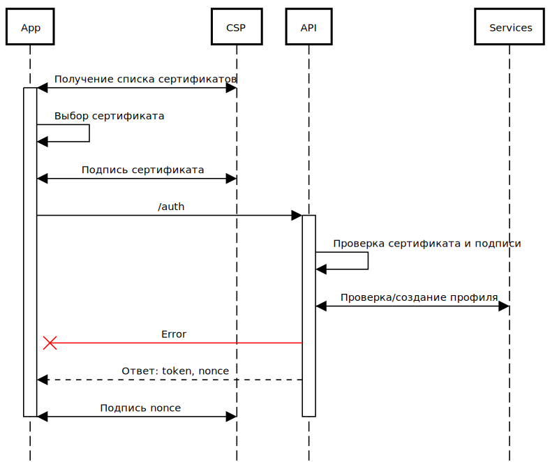

### 1. Аутентификация и регистрация профиля
   
- [Аутентификация с действующим сертификатом](#s1)
- [Аутентификация с просроченным сертификатом и активным профилем](#s2)
- [Подтверждение аутентификации](#s3)
- [Регистрация профиля](#s4)

<a name="s1"></a>
### 1.1. Аутентификация с действующим сертификатом

Клиент выбирает действующий сертификат (base64) и подписывает его простой подписью этим же сертификатом.

Далее выполняем запрос: [/api/auth/](https://api.komandor.app/docs/static/index.html#/Auth/post_api_auth_) с параметрами:


```http request
POST https://api.komandor.app/api/v2/auth
Content-Type: application/json
```
```json
{
  "cert": "(base64) Текущий сертификат",
  "sign": "(base64) Простая подпись сертификата"
}
```

Сервис проверяет сертификат на действительность и корректность подписи, получает или создает профиль, и возвращает 
объект с данными (или код ошибки) для подтверждения аутентификации:

```json
{
  "success": true,
  "data": {
    "nonce": "(base64) Параметр nonce",
    "token": "(jwt) Временный токен аутентификации"
  }
}
```
- `nonce` - случайна строка для подписи или шифрования
- `token` - JWT токен с данными `nonce` и `cid` для подтверждения аутентификации на втором этапе.
Срок действия токена - 1 минута.

Подписываем параметры `nonce` и выполняем [второй этап](#s3).



<a name="s2"></a>
### 1.2. Аутентификация с просроченным сертификатом и активным профилем

Клиент выбирает просроченный сертификат (base64) и не подписывая его выполняем запрос: [/api/auth/](https://api.komandor.app/docs/static/index.html#/Auth/post_api_auth_) с параметрами:


```http request
POST https://api.komandor.app/api/v2/auth
Content-Type: application/json
```
```json
{
  "cert": "(base64) Текущий сертификат"
}
```

Сервис проверяет зарегистрированный сертификат и профиль, возвращает объект с данными (или код ошибки) для 
подтверждения аутентификации:

```json
{
  "success": true,
  "data": {
    "nonce": "(base64) Параметр nonce",
    "token": "(jwt) Временный токен аутентификации",
    "key": "(base64) Ключ шифрования"
  }
}
```

_При просроченном сертификате мы не можем отправлять сообщения т.к. нет возможности поставить подпись, но можем сделать 
синхронизацию всех чатов на новый сертификат._

Шифруем параметр `nonce` ключом `key` и выполняем [второй этап](#s3).


<a name="s3"></a>
### 1.3. Подтверждение аутентификации

Выполняем запрос: [/api/confirmAuth/](https://api.komandor.app/docs/static/index.html#/Auth/post_api_confirmAuth_) для 
подтверждения аутентификации передав параметры `sign` для действующего сертификата или `data` для просроченного сертификата:

```http request
POST https://api.komandor.app/api/v2/confirmAuth
Authorization: Bearer JWT_TOKEN
Content-Type: application/json
```
```json
{
  "sign?": "(base64) Простая подпись nonce",
  "data?": "(base64) Зашифрованный nonce"
}
```

* Далее во всех запросах передается JWT токен сессии. Если токен истек, производим повторную аутентификацию.

Получаем ответ:

```json
{
  "success": "(boolean)",
  "data": {
    "token": "(jwt) Токен сессии",
    "needRegisterPhone": "(boolean)"
  }
}
```

Если параметр `needRegisterPhone = true` то необходимо выполнить регистрацию профиля.


<a name="s4"></a>
### 1.4. Регистрация профиля

Для регистрации профиля необходимо, передать Российский мобильный номер телефона для получения SMS с кодом 
подтверждения. 

Выполняем запрос: [/api/registryPhone/](https://api.komandor.app/docs/static/index.html#/Auth/post_api_registryPhone_) с параметрами:

```http request
POST https://api.komandor.app/api/v2/registryPhone
Authorization: Bearer JWT_TOKEN
Content-Type: application/json
```
```json
{
  "phone": "(format) +79XXXXXXXXX"
}
```

Ответ:

```json
{
  "success": "(boolean)",
  "data": {
    "timeout": "(number) Таймаут в секундах для повторного запроса кода"
  }
}
```

Для подтверждения номера телефона (привязка к профилю) выполняем запрос: [/api/confirmPhone/](https://api.komandor.app/docs/static/index.html#/Auth/post_api_confirmPhone_) с параметрами:

```http request
POST https://api.komandor.app/api/v2/confirmPhone
Authorization: Bearer JWT_TOKEN
Content-Type: application/json
```
```json
{
  "code": "(string) Код подтверждения"
}
```

Ответ:

```json
{
  "success": "(boolean)",
  "error?": "(string) Код ошибки",
  "message?": "(string) Сообщение ошибки",
  "data?": {
    "timeout": "(number) Таймаут в секундах для повторного запроса кода"
  }
}
```

Если код не подтвержден, то будет выдан параметр `timeout` и код ошибки для повторного запроса кода.


