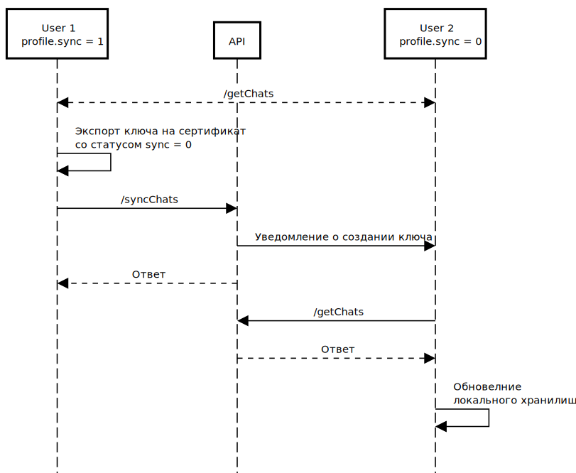

### 4. Регистрация сертификата и синхронизация ключей чатов

#### Условия

1. **Профиль со статусом `profile.sync = 0` - текущий сертификат НЕ синхронизирован на все чаты:**
   - Можно создавать ключи для чатов со статусом `chats.status = new`;
   - Нельзя создавать ключи для чатов со статусом `chats.status = wait`;
   - Можно получать и отправлять сообщения в чаты со статусом `chats.status = sync`.

2. **Профиль со статусом `profile.sync = 1` - текущий сертификат синхронизирован на все чаты:**
   - Можно создавать ключи для чатов со статусом (см. структуру чата)
   
     ```json
     {
       "chats": [{
         "status": "new | wait"
       }]
     }
     ```
   - Можно получать и отправлять сообщения в чаты со статусом `chats.status = sync`.

#### Сценарий 1

- Новый пользователь - первый вход с не зарегистрированным сертификатом;
- Регистрация и подтверждение профиля;
- Передача списка номеров (для создания чатов) с мобильного клиента или через кнопку "Создать чат" (передается один номер);
- Получаем список созданных чатов без ключей со статусом `chats.status = new`;
- Создаем для всех чатов ключи и экспортируем их на все сертификаты контакта;
- Обновляем список чатов в локальном хранилище.

#### Сценарий 2

- Вход с зарегистрированным ранее сертификатом;
- Добавляем новым сертификат через профиль;
- Синхронизируем все чаты на новый сертификат.

#### Сценарий 3

- Имея активный профиль. Вход с новым сертификатом не добавляя его ранее через профиль;
- Профиль со статусом `profile.sync = 0` и все чаты без ключей (для этого сертификата),
показываем предупреждение о необходимости синхронизации;

     ```json
     {
       "chats": [{
         "key": null,
         "status": "wait"
       }]
     }
     ```

- Входим с предыдущим сертификатом `profile.sync = 1`;
- Синхронизируем все чаты на новый сертификат.

#### Сценарий 4

- Вход с новым сертификатом не имея доступа к предыдущим сертификатам;
- Все контакты при получении своего списка чатов - проверяют состояние сертификатов контакта;
- Если у чата есть сертификаты со статусом `profile.sync = 0`, то необходимо создать ключ для этого чата;
- Контакту для которого создавался ключ отправляется уведомление (push, socket) для перезагрузки чата.



### 4.1. Новый пользователь - первый вход с не зарегистрированным сертификатом (сценарий 1)

1. [Аутентификация с действующим сертификатом](1.auth.md#s1)
2. [Синхронизация чатов (ключей)](6.chats.md)

### 4.2. Регистрация нового сертификата в профиле (сценарий 2)

1. [Аутентификация с действующим сертификатом](1.auth.md#s1);
2. Регистрация нового сертификата;
   
   Запрос [/api/certificateRegistration/](https://api.komandor.app/docs/static/index.html#/Auth/post_api_certificateRegistration_)
   ```http request
   POST https://api.komandor.app/api/v2/photo
   Authorization: Bearer JWT_TOKEN
   Content-Type: application/json
   ```
   ```json
   {
     "certificate": "(base64) Сертификат"
   }
   ```

   Ответ

    ```json
    {
      "id": "(string) ID сертификата",
      "cert": "(base64) Сертификат",
      "sync": "(boolean) Статус синхронизации сертификата. True - синхронизирован, false - не синхронизирован"
    }
    ```
3. [Синхронизация чатов (ключей)](6.chats.md)

### 4.3. Вход с новым сертификатом не добавляя его ранее через профиль (сценарий 3)

1. [Аутентификация с новым сертификатом](1.auth.md#s1);
2. Предупреждение о необходимости синхронизации;
3. [Аутентификация с предыдущим сертификатом](1.auth.md#s1);
4. [Синхронизация чатов (ключей)](6.chats.md).
